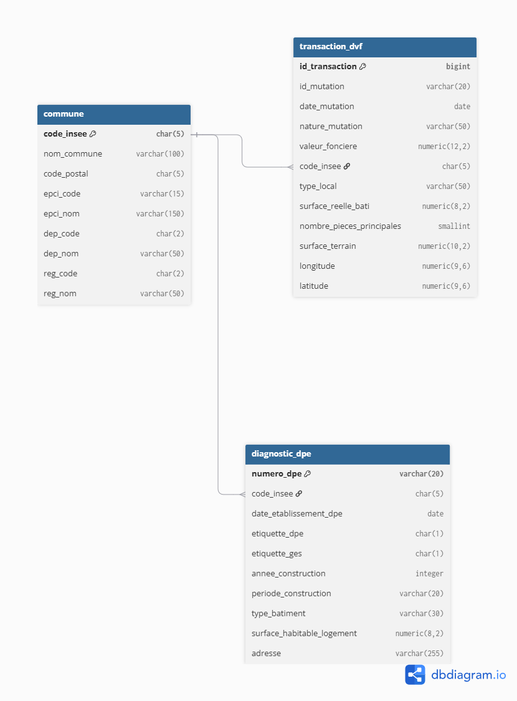

# 4. Modèle conceptuel (MCD)

## Entités

- **COMMUNE** — référentiel géographique (COG), restreint au département 44 (207 communes).
- **TRANSACTION** — une transaction immobilière (mutation DVF), rattachée à une commune.
- **DIAGNOSTIC_DPE** — un diagnostic de performance énergétique, rattaché à une commune.

## Relations et cardinalités

```
COMMUNE 1 ───── N TRANSACTION
COMMUNE 1 ───── N DIAGNOSTIC_DPE
```

Une **commune** est concernée par **0 à N transactions** et **0 à N diagnostics DPE** ; chaque **transaction** et chaque **diagnostic** appartient à **exactement 1 commune**.

## Justification des choix

- **Pas de lien direct TRANSACTION ↔ DIAGNOSTIC_DPE** : les deux sources n'ont pas de clé fiable au niveau du logement (DVF identifie une parcelle, le DPE une adresse géocodée). Le rapprochement se fait donc **au niveau commune**, seule clé fiable aux deux sources, suffisante pour répondre à la problématique.
- **Entité COMMUNE séparée** plutôt que dupliquer les infos géographiques dans chaque table : évite la redondance et garantit une source de vérité unique (le COG), en contrainte d'intégrité référentielle sur les deux autres tables.

## Diagramme

Réalisé sur [dbdiagram.io](https://dbdiagram.io) :

{width=90%}
