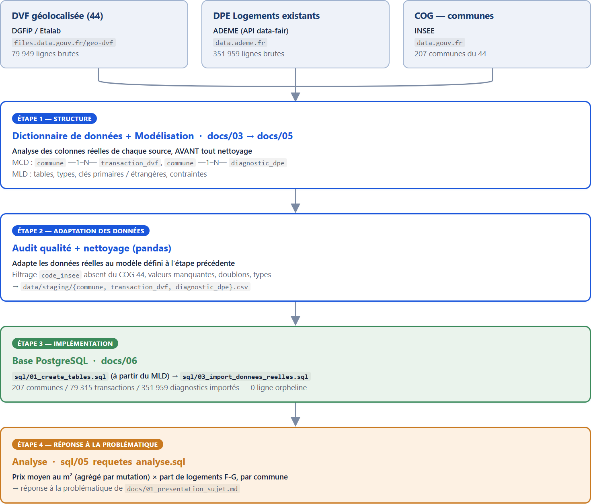

# 7. Cartographie globale

Vue d'ensemble du cheminement, des données brutes à la base PostgreSQL. La structure (dictionnaire, MCD, MLD) est établie en premier à partir des sources réelles — le nettoyage n'intervient qu'ensuite, pour adapter les données à cette structure.

{width=95%}

## Lecture du schéma

1. **Trois sources hétérogènes** sont ramenées à un périmètre commun : le département 44.
2. **Dictionnaire + modélisation** (MCD → MLD) sont établis d'abord, à partir des colonnes réelles. Architecture "en étoile" : deux tables de faits reliées uniquement par la dimension commune (justification en [04_modele_conceptuel.md](04_modele_conceptuel.md)).
3. **Audit qualité et nettoyage** adaptent ensuite les données réelles à ce modèle.
4. **La base PostgreSQL** matérialise le modèle, testée de bout en bout (0 ligne orpheline).
5. **L'analyse** répond à la problématique à l'échelle communale.
