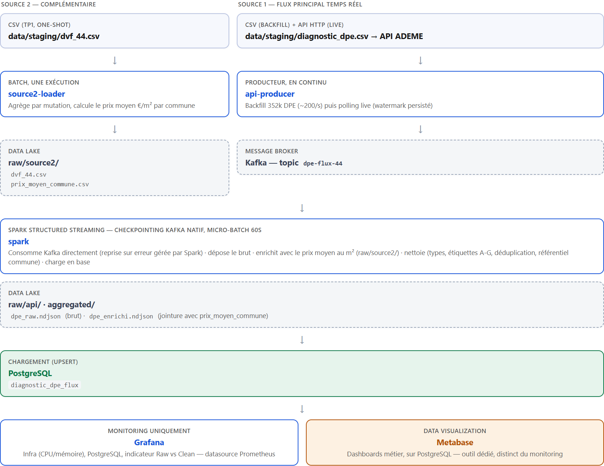

# 8. TP2 — Pipeline data temps réel & plateforme data

Prolonge le TP1 (base PostgreSQL statique, département 44) avec un pipeline temps réel : ingestion via Kafka, data lake brut, nettoyage PySpark, chargement PostgreSQL, dashboard de supervision et dashboard métier.

## Architecture



## Sources

| # | Source | Nature | Rôle |
|---|---|---|---|
| 1 | API ADEME `dpe03existant` (diagnostics de performance énergétique) | API HTTP, alimentée sur Kafka par `api-producer` | Flux principal temps réel |
| 2 | DVF (transactions immobilières, département 44 — déjà utilisée en TP1) | CSV, chargée en un lot par `source2-loader` | Source complémentaire, sert à enrichir le flux 1 |

**Pourquoi ce choix** : les deux sources et le lien entre elles reprennent exactement la problématique du TP1 (marché immobilier × performance énergétique), pour rester cohérent avec la modélisation déjà posée. Réutiliser DVF évite une nouvelle source à qualifier de zéro et permet de vérifier la cohérence des deux TP par recoupement des mêmes indicateurs (cf. Vérification, ci-dessous).

**Pourquoi une phase de "backfill"** : l'API ADEME ne produit que quelques nouveaux DPE par semaine pour le seul département 44 — insuffisant pour observer un flux en conditions de démo courte. `api-producer` rejoue donc d'abord les 352k DPE déjà collectés en TP1 à débit maîtrisé (200 événements/s, réglable via `BACKFILL_RATE_PER_SEC`), marqués `source_flux=backfill`, puis bascule en interrogation continue de l'API réelle (`source_flux=live`, toutes les `POLL_INTERVAL_SECONDS`) à partir d'un filigrane (`watermark`) persisté sur disque. Le backfill ne s'exécute qu'une fois : un marqueur (`/state/backfill_done`) évite de le rejouer à chaque redémarrage du conteneur.

## Data lake

Le sujet propose une organisation MinIO (S3). **MinIO a fermé ses images Docker officielles derrière une authentification** (Docker Hub et quay.io renvoient tous deux 401 au moment du TP), ce qui rend un `docker compose up` reproductible impossible sans compte préalable. Le data lake est donc un volume Docker nommé (`datalake_data`), organisé exactement selon l'arborescence donnée par l'énoncé :

```
raw/api/          dpe_raw.ndjson          — flux Kafka brut, non filtré
raw/source2/       dvf_44.csv, prix_moyen_commune.csv
aggregated/        dpe_enrichi.ndjson      — flux enrichi, avant nettoyage
```

## Agrégation et nettoyage (Spark Structured Streaming)

`spark/jobs/clean_and_load.py` consomme le topic Kafka `dpe-flux-44` directement (`spark.readStream.format("kafka")`, micro-batch toutes les 60s, checkpointing Kafka natif — reprise sur erreur gérée par Spark plutôt qu'un consumer group applicatif fait main). Par micro-batch :

- dépôt du flux brut dans `raw/api/dpe_raw.ndjson` (couche brute, non filtrée) ;
- **enrichissement métier** : jointure avec le prix moyen au m² de la commune du diagnostic (calculé par `source2-loader` à partir de DVF, avec la même correction que le TP1 : agrégation par mutation avant calcul du prix/m², pour ne pas compter plusieurs fois la valeur d'une mutation à plusieurs lots) → `aggregated/dpe_enrichi.ndjson`. Un DPE seul indique une étiquette énergétique ; associé au prix moyen au m² de sa commune, il permet de resituer un logement par rapport à son marché local — la même question que le TP1 (les logements F-G se vendent-ils moins cher ?), évaluée en continu plutôt que sur un instantané ;
- **nettoyage** : contrôle de type, rejet des étiquettes DPE/GES hors A-G, rejet des lignes sans identifiant ou commune, déduplication sur `numero_dpe`, rejet des communes hors référentiel (jointure avec la table `commune` du TP1) ;
- upsert dans PostgreSQL (`INSERT ... ON CONFLICT (numero_dpe) DO NOTHING`, via `psycopg2`) dans la table `diagnostic_dpe_flux` ([sql/06_create_flux_table.sql](../sql/06_create_flux_table.sql)), dont la clé étrangère `code_insee → commune` garantit la cohérence avec le modèle du TP1.

**Choix techniques** : le connecteur Kafka de Spark (`spark-sql-kafka-0-10`) est résolu et figé dans l'image au build (`docker compose build`), pas téléchargé au démarrage — `docker compose up -d` ne dépend d'aucun accès réseau à l'exécution. Chargement PostgreSQL via `psycopg2` plutôt que le writer JDBC de Spark, pour éviter un driver JDBC supplémentaire dans l'image — inutile ici vu le volume (dizaines de milliers de lignes par cycle, pas un usage big data).

## Observabilité (Prometheus + Grafana)

Consigne explicite du formateur : Grafana réservé au monitoring technique (infra, PostgreSQL, indicateur Raw vs Clean) ; la dataviz métier passe par un outil séparé (cf. section suivante).

| Cible | Exportateur | Ce qu'il expose |
|---|---|---|
| Conteneurs (CPU, mémoire) | `docker-stats-exporter` (custom, API Docker) | Infra — remplace cAdvisor, dont la résolution du driver de stockage échoue systématiquement sous Docker Desktop (Windows/Mac) : les conteneurs y tournent dans une VM cachée, `/var/lib/docker` monté depuis l'hôte ne correspond pas au vrai backend de stockage. Remplace aussi node-exporter (un seul hôte, pas de cluster) |
| PostgreSQL | `postgres-exporter` | Connexions actives, disponibilité, taille de la base |
| `api-producer`, `spark` | `prometheus_client` (Python), un exporteur HTTP par service | Métriques métier du pipeline |

**Indicateur Raw vs Clean** (obligatoire) : `raw_records_total` (volume déposé dans `raw/api/`) comparé à `clean_records_total` (`COUNT(*)` réel sur `diagnostic_dpe_flux`). Les deux valeurs partent du volume réellement persisté (fichier / base), pas d'un compteur en mémoire remis à zéro au redémarrage, pour rester comparables dans la durée. `raw ≥ clean` en permanence : l'écart mesure le nettoyage (données rejetées) et le retard du cycle Spark (60s) sur le flux Kafka.

Dashboard Grafana provisionné automatiquement (aucune étape manuelle) : [monitoring/grafana/provisioning/dashboards/tp2_overview.json](../monitoring/grafana/provisioning/dashboards/tp2_overview.json), 8 panels (Raw vs Clean, taux de nettoyage, débit du producteur par source, connexions/disponibilité/taille PostgreSQL, CPU/mémoire par conteneur).

## Data visualization

Outil dédié, distinct de Grafana (consigne du formateur) : Metabase, connecté à PostgreSQL, pour les dashboards métier (répartition des étiquettes DPE, communes les plus chères, part de logements F-G par tranche de prix...). Premier accès sur http://localhost:3001 : assistant de configuration Metabase (se connecter à `db:5432/audit_immo_energie_44`, postgres/postgres), seule étape manuelle du projet — propre à Metabase, qui ne permet pas de provisionner ses dashboards comme du code.

## Comment reproduire

```bash
docker compose up -d
```

Démarre l'ensemble (TP1 + TP2) : base PostgreSQL et son import TP1, data lake, Kafka, le pipeline complet (producteur, Spark Structured Streaming), Prometheus, Grafana et Metabase — sans étape manuelle ni accès réseau obligatoire (le backfill utilise les CSV déjà versionnés ; seule la phase "live" de `api-producer` appelle l'API ADEME, avec repli silencieux si elle est inaccessible). Pour repartir d'un état vide : `docker compose down -v` (non requis en usage normal : la création des tables est idempotente, même sur un volume déjà initialisé par le TP1).

## Comment vérifier

| Composant | Comment vérifier |
|---|---|
| Kafka | `docker exec tp2_kafka /opt/kafka/bin/kafka-get-offsets.sh --bootstrap-server localhost:19092 --topic dpe-flux-44` → nombre de messages produits |
| Data lake | `docker exec tp2_spark sh -c "wc -l /datalake/raw/api/dpe_raw.ndjson /datalake/aggregated/dpe_enrichi.ndjson"` |
| PostgreSQL (flux) | `docker exec tp_audit_44_pg psql -U postgres -d audit_immo_energie_44 -c "SELECT COUNT(*) FROM diagnostic_dpe_flux;"` |
| Reprise sur erreur | `docker kill tp2_spark && docker compose up -d spark` → reprend depuis le checkpoint Kafka, sans rejouer ni perdre d'événements |
| Prometheus | http://localhost:9090/targets — les 4 cibles (docker-stats-exporter, postgres, api-producer, spark) doivent être `UP` |
| Grafana | http://localhost:3000 (admin/admin, ou accès anonyme activé) — dashboard *TP2 — Pipeline temps réel* (monitoring uniquement) provisionné automatiquement |
| Metabase | http://localhost:3001 — dataviz métier |
| Métriques brutes | http://localhost:8001/metrics (producteur), http://localhost:8003/metrics (Spark), http://localhost:8004/metrics (docker-stats-exporter) |

## Ports exposés

| Port | Service |
|---|---|
| 5432 | PostgreSQL |
| 9092 | Kafka (accès externe) |
| 8001 / 8003 | Métriques Prometheus : producteur / Spark |
| 8004 | Métriques Prometheus : docker-stats-exporter |
| 9187 | postgres-exporter |
| 9090 | Prometheus |
| 3000 | Grafana |
| 3001 | Metabase |
